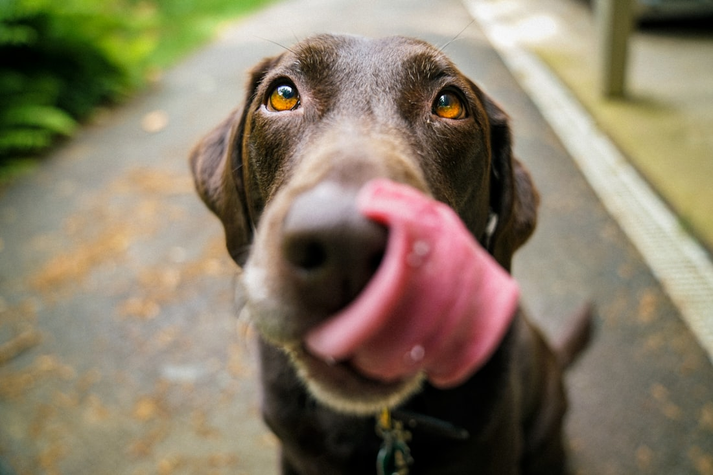

# PetFriendly React - MVP Front-end Avançado

Aplicação front-end em React para o ecossistema PetFriendly, com foco em componentização, roteamento, usabilidade e organizações de codigo para avaliação académica.


## Descrição breve

Este projeto apresenta uma interface web com navegação entre páginas, busca de serviços, tela de detalhes e fluxo de agendamento. O MVP foi desenvolvido com componentes reutilizáveis e dados simulados em JSON local, atendendo aos critérios de execução do trabalho.

## Objetivo do projeto

- Explorar React com componentização em um caso prático.
- Aplicar hooks de estado, efeito e navegação.
- Construir uma interface responsiva com feedback visual ao usuário.
- Entregar uma base organizada para evolução futura com APIs deployadas.

## Tecnologias utilizadas

- React
- Vite
- React Router DOM
- JavaScript (ES6+)
- CSS

## Funcionalidades

- Navegação entre páginas com React Router.
- Busca de serviços por texto.
- Visualização de detalhes por rota dinâmica.
- Formulário de agendamento com validação local.
- Feedbacks visuais de carregamento, sucesso, erro e lista vazia.

## Requisitos do MVP atendidos

### Componentização e páginas

- Aplicação com 3+ páginas funcionais.
- Uso de componentes reutilizaveis no layout e nos fluxos de tela.

### Componentes reutilizaveis implementados

- Header
- SearchBar
- ServiceCard
- FeedbackAlert
- LoadingSpinner

### React Router e hooks obrigatorios

- useNavigate
- useParams
- useLocation
- Rota 404 implementada

### Estado e ciclo de vida

- useState e useEffect aplicados em busca/listagem e Formulário.

### Usabilidade e responsividade

- Indicador de carregamento.
- Mensagens condicionais de status.
- Layout adaptavel para desktop, tablet e celular.

### Dados simulados

- Leitura de dados locais por JSON (services.json), simulando requisição.

## Estrutura de pastas

```text
src/
  components/
  pages/
  routes/
  data/
  styles/
  config/
  services/
public/
  decor/
docs/
```

## Etapas de desenvolvimento (historico resumido)

### Etapa 1 - Base do projeto

- Inicialização do projeto com Vite + React.
- Configuração de roteamento e estrutura de pastas.

### Etapa 2 - Telas principais

- Implementação das páginas Home, Services, ServiceDetail, Booking e NotFound.
- Definição de componentes reaproveitaveis para manter consistência.

### Etapa 3 - Usabilidade e qualidade

- Adição de loading, alertas de status e mensagem de nenhum resultado.
- Ajustes de responsividade para diferentes tamanhos de tela.
- Validação de lint e build.

### Etapa 4 - Preparação para integração externa

- Centralização de endpoints em arquivo de configuração.
- Criação de serviço HTTP isolado para Dog API.
- Planejamento de deploy no Render para os serviços relacionados.

## Instalação e execução local

### Pre-requisitos

- Node.js 18+
- npm

### Passo a passo

1. Clonar o repositório.
2. Entrar na pasta do projeto.
3. Instalar dependências.
4. Executar em modo desenvolvimento.

   meu diretório: https://github.com/Elainecbr/PetFriendly-React/

```bash
git clone https://github.com/Elainecbr/petfriendly-react.git
cd petfriendly-react
npm install
npm run dev
```

### Comandos disponiveis

- npm run dev: inicia servidor de desenvolvimento.
- npm run lint: executa verificações de qualidade.
- npm run build: gera build de produção.
- npm run preview: pre-visualiza build localmente.

## Documentação dos arquivos de codigo

### Nucleo

- src/main.jsx: bootstrap do React e BrowserRouter.
- src/App.jsx: componente raíz.
- src/routes/AppRoutes.jsx: mapa de rotas, incluindo dinâmica e 404.

### páginas

- src/pages/Home.jsx: pagina inicial com navegação e busca rapida.
- src/pages/Services.jsx: listagem com busca, loading e feedback.
- src/pages/ServiceDetail.jsx: detalhes por id com useParams.
- src/pages/Booking.jsx: Formulário com validação e mensagem de status.
- src/pages/NotFound.jsx: fallback para URL inexistente.

### Componentes reutilizaveis

- src/components/Header.jsx
- src/components/SearchBar.jsx
- src/components/ServiceCard.jsx
- src/components/FeedbackAlert.jsx
- src/components/LoadingSpinner.jsx

### Dados e integrações

- src/data/services.json: dados simulados locais.
- src/config/api.js: configurações de endpoints.
- src/services/dogApi.js: camada de acesso a API externa.

### Estilos e assets

- src/styles/app.css: estilos globais e responsividade.
- public/decor/: assets estáticos servidos em produção.

## Imagens do projeto

As imagens abaixo podem ser usadas no README e na apresentação do MVP:




## Links dos serviços relacionados (MVPs)

Atualize os links abaixo conforme seus repositórios/deploys oficiais:

- <https://petfriendly-dashboard.onrender.com/>

| Projeto | Repositorio GitHub | Deploy |
| --- | --- | --- |
| pet-web | [repositorio](https://github.com//Elainecbr/pet-web-frontend) | [deploy](https://pet-web-frontend.onrender.com/) |
| petfriendly | [repositorio](https://github.com//Elainecbr/petfriendly-dashboard) | [deploy](https://petfriendly-dashboard.onrender.com/) |
| api-saude-dog-in pet-web | [repositorio](https://github.com/Elainecbr/pet-web-frontend) | [deploy](https://pet-web-frontend.onrender.com/#consulta-saude-pet)
| petfriendly-react (este projeto) | [repositorio](https://github.com/Elainecbr/petfriendly-react) | [deploy](https://petfriendly-react.onrender.com/) |

## Planejamento de deploy no Render

Este repositório ja esta preparado para deploy web estático (front-end) apos concluir os estudos do Render.

- Build command: npm run build
- Publish directory: dist

Checklist detalhado:

- docs/checklist-deploy-render.md

## SDD / Technical Implementation Plan

Para explicitar o processo de planejamento técnico em formato alinhado a SDD (Specification-Driven Development), este projeto também inclui um documento de implementação técnica com escopo, requisitos, arquitetura, decisões de design e critérios de validação.

- docs/technical-implementation-plan.md

## Roteiro do video de entrega (max. 5 min)

### Roteiro pronto para gravação:
    - Objetivo
    - Objetivo do projeto
        - Problema que a aplicacao resolve.
        - Contexto PetFriendly.
        - Resultado esperado para o usuario.
    - Componentizacao (4+ componentes)
        - Mostrar os componentes, o que são, os reutilizados e onde aparecem:
        - Header
        - SearchBar
        - ServiceCard
        - FeedbackAlert
        - LoadingSpinner
        - Explicar rapidamente a vantagem de reaproveitamento
    - Navegacao e roteamento
        - Rotas principais.
        - Rota dinamica de detalhes.
        - Rota 404.
        - Uso de useNavigate, useParams e useLocation.
    - Usabilidade
        - Mostrar em funcionamento:
          - Loading.
          - Mensagem de nenhum item encontrado.
          - Mensagem de sucesso/erro no agendamento.
          - Busca rapida na Home para Servicos
    - Responsividade
          - Troca de viewport desktop para mobile.
          - Comentar que layout permanece legivel e funcional.
    - Encerramento
          - Onde esta o repositorio.
          - Onde esta o deploy (quando publicado).  

## Para entrega final

- repositório publico GitHub deste front-end.
- Link do video de apresentação.
- Links dos MVPs e APIs relacionados.
- Documento técnico SDD / technical implementation plan no docs/.

## Autoria

Projeto desenvolvido por Elaine C. Bundscherer para a disciplina de Front-end Avancado (MVP).

